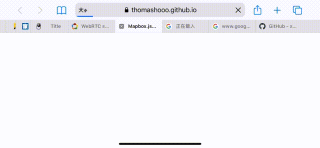

# mapboxtest
## issue:
[https://github.com/mapbox/mapbox-gl-js/issues/10554](https://github.com/mapbox/mapbox-gl-js/issues/10554)

## symbol layer moving compare(v1.2.0 - v2.2.0) url:
[https://thomashooo.github.io/mapboxtest/](https://thomashooo.github.io/mapboxtest/)

## custom version use:
	
	https://thomashooo.github.io/mapboxtest/symbolTest.html#?v=MAPBOX_VERSION_NUMBER

## test gif:
